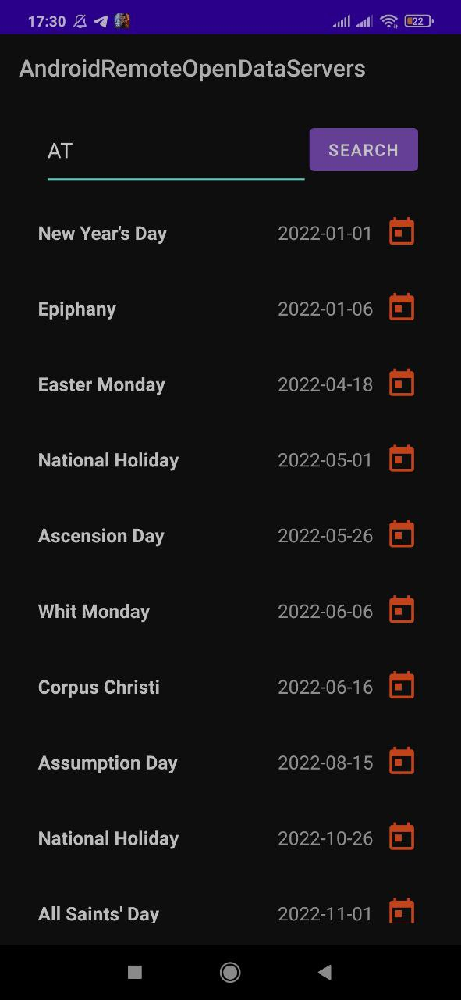
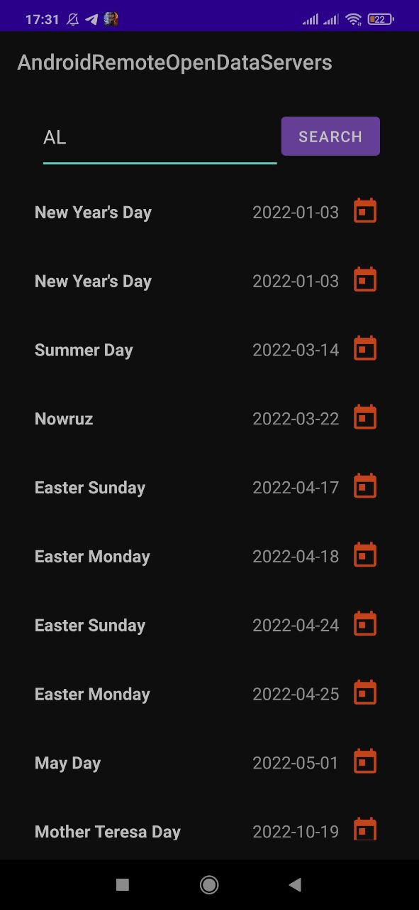
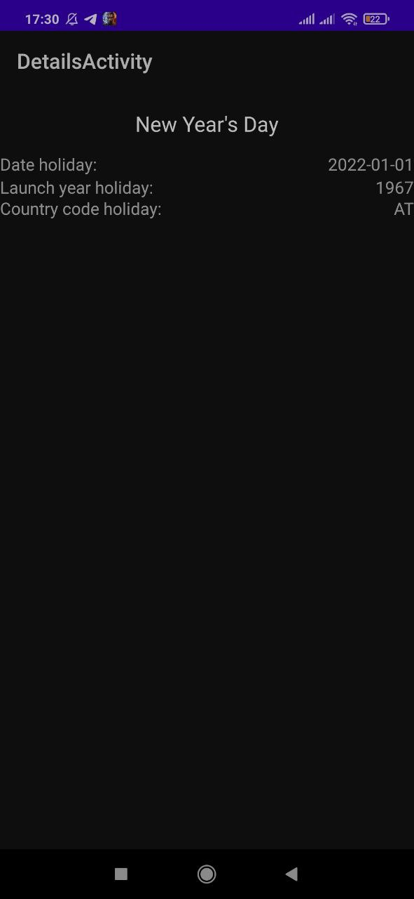

# AndroidRemoteOpenDataServers

## Preview
1. This project uses jdk 8;
2. This project uses MVVM architecture.
3. This project executes network request. 
Use for this network clients OkHttp and Retrofit.
4. This project works with SQLite db using the Room library.

## Features
☑️ The application performs network requests to a remote 
service on receiving data in GSON format using OkHttp clients
and/or Retrofit.

☑️ The received data is cached in the local database, on
case of loss of network connection. If the service or network
are not available, then the data is displayed in the interface of the application
local database. When requesting data, a check is performed
to match the data in the local database. If the data is from a remote
service have changed, then the data in the local database is updated.

☑️ The application consists of two screens. The first screen shows the data in a list. 
When you click on any item in the list, it starts
another screen with detailed information when the item is selected.

## Launch guide
To run this project you will need to install this project in phone with Android Operating System.

## Program testing
<i><b>Main Activity</b></i> 

 <i><b>Details Activity</b></i> 
For example, for country AT holidays 

